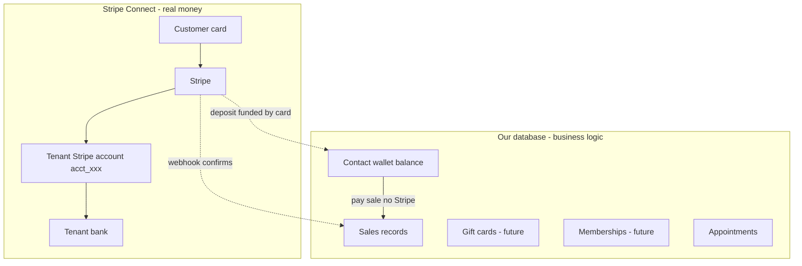
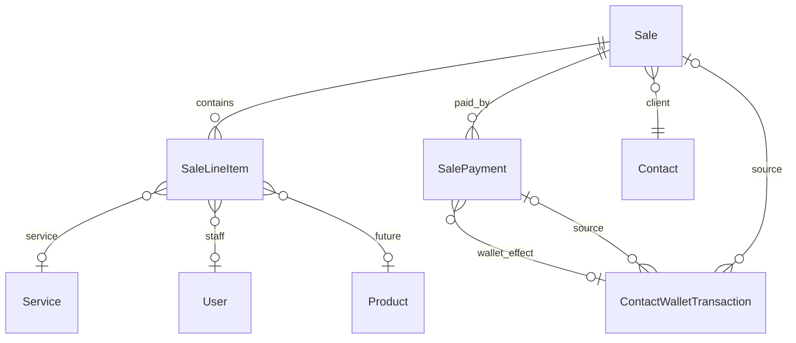
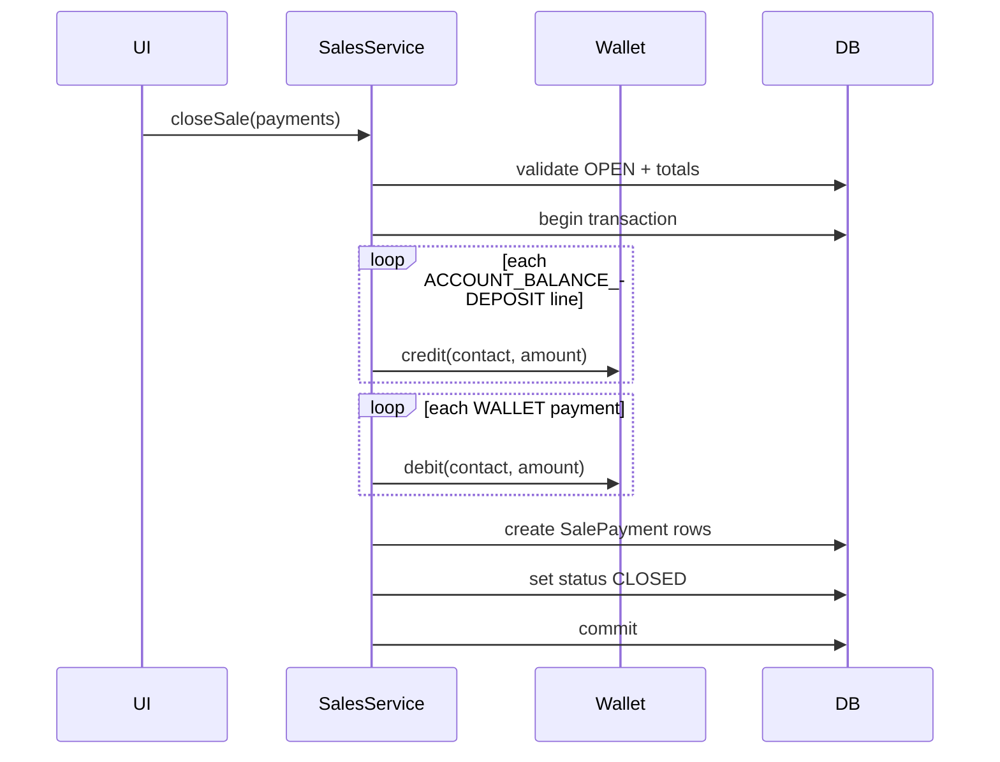

# Sales / POS Feature Plan

## Current state

- **No Sale entity** — contact timeline "sales" events are invoices + payments ([`contact-timeline.service.ts`](backend/libs/modules/crm/contacts/services/contact-timeline.service.ts)).
- **Wallet exists** — `ContactWalletBalance` + `ContactWalletTransaction` with manual credit/debit ([`contact-wallet.service.ts`](backend/libs/modules/crm/contacts/services/contact-wallet.service.ts)).
- **Services + staff** — `Service`, `ServiceCategory`, `ServiceStaff` (staff = business `User` members).
- **Payments** — tied to `Invoice` only; not suitable for POS checkout ([`Payment`](backend/prisma/schema.prisma) requires `invoiceId`).
- **Products / packages / offers / gift cards** — not built; memberships stub returns "coming soon".

## Architecture principles (canonical model)

This is the target mental model for the whole platform (Mangomint / Boulevard style). **Sales implements the app-ledger half; Stripe card flows are a separate Payment Implementation.**

### Actors

| Actor | In our codebase |
|-------|-----------------|
| **SaaS platform (you)** | Platform Stripe for subscriptions only |
| **Tenant business** | `Business` — med spa, salon, clinic |
| **End customer** | `Contact` — buys services, products, deposits |

### Money vs ledger



**Stripe** — card storage, charges, subscriptions, refunds. Each tenant connects their own account (`BusinessIntegration.config.stripeAccountId`). Money never sits on the platform account for customer purchases.

**Our DB** — wallet balance, gift card balance, sales line items, appointments, memberships status. Wallet is **not** inside Stripe.

### Flows (matches your examples)

| Scenario | Stripe | Our wallet DB |
|----------|--------|---------------|
| $70 massage paid by card | Charge `PaymentIntent` on `stripeAccount` | Optional `Sale` record |
| $100 wallet deposit (cash) | None | Credit +$100 |
| $100 wallet deposit (card) | Charge $100 → tenant account | Credit +$100 after webhook |
| $70 service paid from wallet | None | Debit −$70 |
| $70 service, $20 wallet + $50 card | Charge $50 | Debit −$20 |
| Membership $99/mo | Stripe Subscription on connected account | Update membership status via webhook |

### What exists today vs Sales plan vs Payment Implementation

| Piece | Today | Sales plan (this doc) | Payment Implementation (later) |
|-------|-------|----------------------|--------------------------------|
| Stripe Connect per tenant | Yes | — | Extend |
| `ContactWalletBalance` + transactions | Yes | Wire to sales close | Card-funded deposits |
| `Sale` + line items + payments | No | **Build** | — |
| Saved cards / Payment Element | No | Hooks only on `SalePayment` | **Build** |
| Gift cards / memberships | Stubs | Line-item stubs | Full modules |

---

## Sales module architecture

Sales is a **checkout session** (open → pay → closed), separate from invoices. Invoices remain for async billing; closed sales may optionally generate an invoice in a future phase.





---

## 1. Prisma schema

Add to [`backend/prisma/schema.prisma`](backend/prisma/schema.prisma):

### Enums

```prisma
enum SaleStatus { OPEN CLOSED VOID }

enum SaleLineItemType {
  SERVICE
  PRODUCT           // stub until products module
  ACCOUNT_BALANCE_DEPOSIT
  GIFT_CARD         // stub
  PACKAGE           // stub
  OFFER             // stub
  CUSTOM
}

enum SalePaymentMethod {
  CASH
  CARD              // manual entry in Phase 1; Stripe-charged card in Phase 3
  BANK_TRANSFER
  WALLET            // internal contact wallet balance
  SAVED_CARD        // Phase 3 — charge contact's saved Stripe payment method
  OTHER
}

enum SalePaymentStatus {
  PENDING           // Stripe PaymentIntent created, awaiting confirmation
  SUCCEEDED         // funds captured / manual tender recorded
  FAILED
  CANCELLED
  REFUNDED
}
```

Extend `ContactWalletTransactionType`:

```prisma
SALE_DEPOSIT   // account balance deposit line on close
SALE_PAYMENT   // customer paid with wallet at checkout
SALE_REFUND    // future void/refund
```

### Models

**`Sale`**
| Field | Notes |
|-------|-------|
| `id`, `businessId`, `contactId?` | contact optional while drafting, required before close |
| `saleNumber` | int, unique per business — display as "Sale #30" |
| `status` | `SaleStatus`, default `OPEN` |
| `saleDate` | date of transaction |
| `subtotal`, `discountAmount`, `taxAmount`, `totalAmount` | decimals; MVP: tax/discount default 0 |
| `currency` | from financial settings |
| `notes` | optional |
| `appointmentId?` | optional link to checkout-from-appointment (future) |
| `invoiceId?` | optional link if invoice generated later |
| `createdById`, `updatedById`, `closedById?` | audit |
| `closedAt?`, `deletedAt?`, timestamps | soft delete |

Indexes: `(businessId, saleNumber)`, `(businessId, status, saleDate)`, `(businessId, contactId)`.

**`SaleLineItem`**
| Field | Notes |
|-------|-------|
| `saleId`, `businessId` | |
| `lineType` | `SaleLineItemType` |
| `sortOrder` | int |
| `title` | snapshot name (service/product name at sale time) |
| `description?` | |
| `quantity` | decimal, default 1 |
| `unitPrice`, `totalPrice` | supports "Change price" override |
| `serviceId?` | for SERVICE lines |
| `staffUserId?` | for SERVICE — "with Andre" |
| `productId?` | nullable FK stub (no Product model yet — store UUID only when linked later) |
| `packageId?`, `offerId?`, `giftCardId?` | nullable UUID stubs |
| `metadata` | Json for future fields (gift card code, offer terms) |

**`SalePayment`**
| Field | Notes |
|-------|-------|
| `saleId`, `businessId`, `contactId` | |
| `amount`, `method` | `SalePaymentMethod` |
| `status` | `SalePaymentStatus` — `SUCCEEDED` for cash/bank/wallet in Phase 1; `PENDING`→`SUCCEEDED` for Stripe in Phase 3 |
| `paidAt` | set on `SUCCEEDED` |
| `reference?`, `notes?` | bank ref, etc. |
| `walletTransactionId?` | links wallet debit/credit |
| `contactPaymentMethodId?` | FK to saved card used (Phase 3) |
| `provider` | `MANUAL` (Phase 1) or `STRIPE` (Phase 3) |
| `stripePaymentIntentId?` | unique when set |
| `stripeChargeId?` | from webhook |
| `providerMetadata?` | Json — event ids, failure codes, card last4 snapshot |
| `createdById` | |

**`ContactStripeCustomer` / `ContactPaymentMethod`** — owned by **Payment Implementation**, not Sales. Sales `SalePayment` may reference `contactPaymentMethodId` and `stripePaymentIntentId` when that workstream connects.

**Wallet linkage** — add optional `saleId`, `salePaymentId?`, `saleLineItemId?` on `ContactWalletTransaction`.

**Financial settings** — extend [`BusinessFinancialSettings`](backend/libs/modules/platform/business/types/financial-settings.types.ts):

```ts
sale: { prefix: string; nextNumber: number }  // prefix unused in UI ("Sale #N"), sequence only
```

Reuse [`FinancialSettingsService.allocateInvoiceNumber`](backend/libs/modules/platform/business/services/financial-settings.service.ts) pattern → `allocateSaleNumber(businessId)`.

**Product stub** — no `Product` table yet. Line items store `title` + `unitPrice`; `productId` nullable. Separate lightweight catalog endpoint returns `[]` until products ship.

---

## 2. Backend module

New package: [`backend/libs/modules/finance/sales/`](backend/libs/modules/finance/sales/)

```
sales/
├── controllers/sales.controller.ts
├── controllers/sale-checkout.controller.ts   # line items + payments on open sales
├── controllers/product-catalog-stub.controller.ts
├── services/sales.service.ts
├── services/sale-checkout.service.ts
├── services/sale-close.service.ts            # atomic close + wallet effects
├── services/sale-calculations.util.ts
├── repositories/sale.repository.ts
├── dto/ (list, create, update, line-item, payment, response)
├── mappers/sale.mapper.ts
└── sales.module.ts
```

Register in [`finance.module.ts`](backend/libs/modules/finance/finance.module.ts) + [`finance-api.module.ts`](backend/libs/modules/finance/finance-api.module.ts).

### API surface

| Method | Path | Purpose |
|--------|------|---------|
| GET | `/sales` | Paginated list — filters: `status`, `contactId`, `dateFrom`, `dateTo`, `search` |
| POST | `/sales` | New checkout (OPEN, optional contact) |
| GET | `/sales/:id` | Full detail: contact, lines, payments, audit users |
| PATCH | `/sales/:id` | Update contact/date/notes (OPEN only) |
| DELETE | `/sales/:id?confirm=true` | Soft-delete OPEN sales |
| POST | `/sales/:id/line-items` | Add line (type + payload) |
| PATCH | `/sales/:id/line-items/:lineId` | Update price/qty/staff |
| DELETE | `/sales/:id/line-items/:lineId` | Remove line |
| POST | `/sales/:id/close` | Apply payments, wallet effects, close |
| POST | `/sales/:id/void` | Void closed sale + reverse wallet (phase 2) |
| GET | `/sales/picker/services` | Searchable service catalog grouped by category (for Add Service dropdown) |
| GET | `/product-catalog/items` | Stub — returns `{ items: [] }` with search param; later wired to products |

### Business rules (`SaleCloseService`)

1. Sale must be `OPEN`; contact required.
2. Recalculate totals from line items before close.
3. Sum of `SalePayment` amounts must equal `totalAmount` (allow configurable overpay tolerance later).
4. **Wallet payment**: debit `ContactWalletBalance`; create `ContactWalletTransaction` type `SALE_PAYMENT`; fail if insufficient.
5. **Account balance deposit lines**: on close, credit wallet per line (`SALE_DEPOSIT`); description includes sale number.
6. All wallet + sale updates in a single Prisma `$transaction`.
7. Audit: `sale.created`, `sale.line_item.added`, `sale.closed`, `sale.voided`.

### Wallet service refactor

Extract shared `applyWalletDelta(businessId, contactId, amount, type, { saleId, description })` from [`ContactWalletService`](backend/libs/modules/crm/contacts/services/contact-wallet.service.ts) so sales close and manual adjustments share balance logic.

### Line item defaults

- **SERVICE**: default `unitPrice` from `Service.price` or `ServiceStaff.price` override for selected staff; `title` = service name.
- **PRODUCT** (stub): client sends `title` + `unitPrice`; `productId` optional.
- **ACCOUNT_BALANCE_DEPOSIT / GIFT_CARD / PACKAGE / OFFER**: client sends `title` + `amount`; stored as CUSTOM-like lines with typed enum for reporting.
- **More menu stubs**: backend accepts line types immediately; UI shows amount input dialogs; entity FKs remain null until future modules.

### Payment integration mindset (out of scope for Sales — separate workstream)

Sales records **how** a sale was paid (`SalePayment.method`, `provider`, optional `stripePaymentIntentId`). When Payment Implementation ships:

- Charges use `stripe.paymentIntents.create({ amount }, { stripeAccount: tenant.stripeAccountId })`
- Saved cards live on the tenant's connected account (Stripe Customer + PaymentMethod per contact)
- Wallet deposits funded by card: Stripe charge first → webhook → then credit `ContactWalletBalance`
- Paying with wallet: ledger debit only, no Stripe

Sales `close` API must accept split tender (wallet + card amounts) so Payment Implementation can plug in without schema changes.

### Other integrations (hooks only)

| Future module | Hook |
|---------------|------|
| Products | `SaleLineItem.productId` + `/product-catalog/items` |
| Packages / memberships | `packageId`, contact memberships service |
| Offers | `offerId`, price adjustment metadata |
| Gift cards | `giftCardId`, metadata.code |
| Appointments | `Sale.appointmentId`, "checkout from appointment" action |

### Contact timeline

Update [`contact-timeline.service.ts`](backend/libs/modules/crm/contacts/services/contact-timeline.service.ts): `type: 'sale'` events from `Sale` table (not invoices/payments).

### Capabilities & permissions

Extend [`capability-module.registry.ts`](backend/libs/modules/platform/capabilities/registries/capability-module.registry.ts) under `payments` module (or new `sales` sub-option):

- `payments.sales.list`, `payments.sales.write`, `payments.sales.collect`
- Route: `/business/sales`
- Contact workspace option: `workspace.sales`

### Tests

- `sale-calculations.util.spec.ts` — totals, price overrides
- `sale-close.service.spec.ts` — wallet credit on deposit, wallet debit on payment, insufficient balance
- `sales.service.spec.ts` — numbering, OPEN-only edits

---

## 3. Frontend

New feature: [`frontend/features/sales/`](frontend/features/sales/)

```
sales/
├── api/sales.api.ts
├── api/sale-checkout.api.ts
├── api/product-catalog-stub.api.ts
├── hooks/ (list, detail, mutations, checkout)
├── schemas/sale-checkout.ts
├── components/
│   ├── sales-page.tsx              # master-detail shell
│   ├── sales-list-panel.tsx        # table: #, status, date, client, total
│   ├── sale-checkout-sidebar.tsx   # open/closed detail
│   ├── sale-line-item-row.tsx
│   ├── add-service-picker.tsx      # searchable category list (screenshot pattern)
│   ├── add-product-dialog.tsx      # manual title+price until catalog exists
│   ├── add-more-menu.tsx           # Gift Card, Package, Offer, Account Balance
│   ├── sale-payments-panel.tsx     # transactions list (Cash, Bank, Wallet)
│   ├── sale-close-dialog.tsx       # "Go to payments" flow
│   └── sale-details-footer.tsx     # created/updated by, date
├── types/index.ts
└── utils/sale-display.ts
```

Route: [`frontend/app/(business)/business/sales/page.tsx`](frontend/app/(business)/business/sales/page.tsx)

### UI layout (copy conversations master-detail)

Mirror [`conversations-inbox.tsx`](frontend/features/conversations/components/conversations-inbox.tsx):

- Left: list + "New Checkout" button + filters (status, date range, client search)
- Right: checkout sidebar; URL-driven selection `?saleId=...`
- OPEN sale: editable lines, Add Service / Add Product / More buttons, subtotal, "Go to payments"
- CLOSED sale: read-only lines, payments section, sale metadata (like Mangomint Sale #28 screenshot)

### Staff picker

For service lines, staff dropdown = business members assigned to that service via `ServiceStaff` (fallback: all business members).

### Wallet UX

- Show contact wallet balance in sidebar header when contact selected.
- Payment step: amount fields for Cash / Bank Transfer / Wallet (split payments allowed).
- Wallet option disabled if no contact or zero balance.

### Payments UX (Stripe-ready shell in Phase 1)

- Payment panel layout reserves a **"Card"** section (disabled / "Connect Stripe in Settings" when integration not ready).
- When Stripe connected (Phase 3): show saved cards for contact + "Add card" + embedded Payment Element for new card — all inside `sale-close-dialog`, no external redirect.
- Split tender UI supports wallet + card in one close action.

### Navigation

Add to [`business-menu.ts`](frontend/lib/config/navigation/business-menu.ts):

```ts
{ title: "Sales", href: "/business/sales", icon: ShoppingCart }
```

Update [`route-capability-map.ts`](frontend/lib/capabilities/route-capability-map.ts), [`page-metadata.ts`](frontend/lib/config/page-metadata.ts), default snapshot nav, query keys + invalidation.

### Query keys

```ts
sales: {
  list(filters), detail(id), servicePicker(search)
}
```

Invalidate sales list + detail + contact wallet + contact timeline on close.

---

## 4. Phased delivery

### Phase 1 — Core POS (ship first)

- Full schema + migration
- Sale CRUD, line items (SERVICE + ACCOUNT_BALANCE_DEPOSIT + CUSTOM)
- Close with CASH, BANK_TRANSFER, WALLET
- Service picker with staff + price override
- Sales list + checkout sidebar UI
- Wallet integration on close
- Contact timeline wired to Sales

### Phase 2 — Stub line types + polish

- PRODUCT (manual entry), GIFT_CARD, PACKAGE, OFFER line types (amount dialogs)
- `/product-catalog/items` stub API
- Sale void + wallet reversal
- Filters/options panel on list

### Phase 3 — Catalog + appointment links

- Wire `productId`, `packageId`, `offerId`, `giftCardId`
- Optional invoice generation from closed sale
- Checkout from appointment

*(Stripe card charging, saved cards, memberships billing — separate **Payment Implementation** plan.)*

---

## 5. Key files to leverage

| Pattern | Reference |
|---------|-----------|
| Document numbering | [`financial-settings.service.ts`](backend/libs/modules/platform/business/services/financial-settings.service.ts) |
| Wallet transactions | [`contact-wallet.service.ts`](backend/libs/modules/crm/contacts/services/contact-wallet.service.ts) |
| Line item math | [`invoice-calculations.util.ts`](backend/libs/modules/finance/invoices/utils/invoice-calculations.util.ts) |
| Module structure | [`invoices.module.ts`](backend/libs/modules/finance/invoices/invoices.module.ts) |
| Master-detail UI | [`conversations-inbox.tsx`](frontend/features/conversations/components/conversations-inbox.tsx) |
| Service tree picker | [`service-categories.api.ts`](frontend/features/services/api/service-categories.api.ts) |

---

## 6. Out of scope for Sales (separate workstreams)

- **Payment Implementation** — saved cards, Payment Element, PaymentIntent, webhooks, card-funded wallet deposits, membership Stripe subscriptions
- Tax engine / discounts (schema ready, UI defaults to 0)
- Gift card issuance/redemption logic (line-item stub only)
- Membership billing cycles
- Inventory deduction for products
- Auto-sync to QuickBooks
