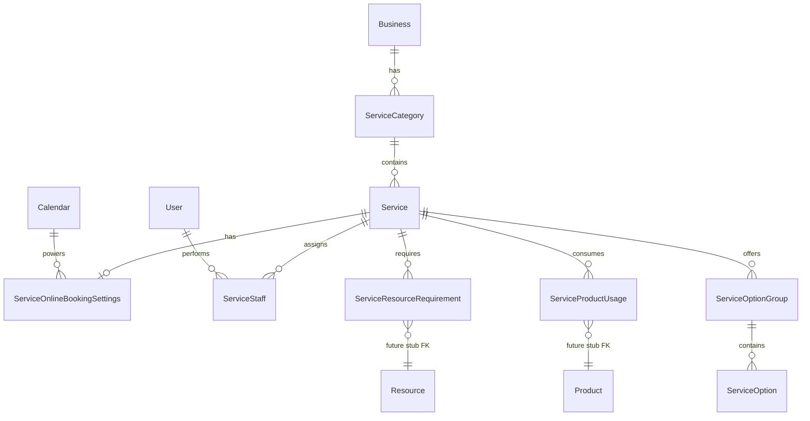

# Services Module — Mangomint Parity Plan

## Terminology (align with Mangomint UI)

| Mangomint UI | Our model |
|--------------|-----------|
| Category (e.g. HAIRCUTS) | `ServiceCategory` |
| Service in sidebar (e.g. Long Cut) | `Service` (user called these “sub-categories”; no extra nesting entity) |
| Staff tab per service | `ServiceStaff` junction |
| Resources | `ServiceResourceRequirement` (stub FK until Resources module) |
| Customizations | `ServiceOptionGroup` + `ServiceOption` |
| Online Booking tab | `ServiceOnlineBookingSettings` + computed direct links |
| Advanced options (create form) | Flags on `Service` + `ServiceProductUsage` stub rows |



---

## Current state

- [`Service`](backend/prisma/schema.prisma) is flat: `name`, free-text `category`, `price`, `status` — no duration, staff, booking, resources, or customizations.
- CRUD only in [`backend/libs/modules/crm/services/`](backend/libs/modules/crm/services/).
- Settings UI is a paginated table: [`frontend/features/settings/components/business-services-settings.tsx`](frontend/features/settings/components/business-services-settings.tsx).
- Public booking accepts `serviceId` on create but **availability ignores service duration** ([`booking-availability.service.ts`](backend/libs/modules/operations/public-booking/services/booking-availability.service.ts)); direct links are calendar-only ([`public-booking-url.util.ts`](backend/libs/modules/operations/public-booking/utils/public-booking-url.util.ts)).

---

## Phase 1 — Prisma schema + migration

### New models

**`ServiceCategory`**
- `id`, `businessId`, `name`, `description?`, `sortOrder` (default 0), `status` (reuse `ServiceStatus` or new `ACTIVE|INACTIVE`), `deletedAt`, timestamps
- `@@index([businessId, sortOrder])`

**Extend `Service`**
- `categoryId` → `ServiceCategory` (required after backfill)
- `durationMinutes` Int `@default(60)` — primary active segment (shown in create form duration dropdown)
- `sortOrder` Int `@default(0)`
- `isDemo` Boolean `@default(false)` (Mangomint “Demo” badge)
- **Processing time** (Mangomint: “client unattended; provider available for other appointments”):
  - `hasProcessingTime` Boolean `@default(false)`
  - `processingDurationMinutes` Int `@default(0)` — gap where client waits but staff is **not** blocked
  - `finishDurationMinutes` Int? — optional second active segment after processing (e.g. rinse/style after color processes); null when no second segment
- **Buffer time** (Mangomint: “block time before or after for prep or cleanup”):
  - `hasBufferTime` Boolean `@default(false)`
  - `bufferBeforeMinutes` Int `@default(0)` — prep/setup block before service
  - `bufferAfterMinutes` Int `@default(0)` — cleanup block after service
- **Advanced options** (Mangomint “Additional options” on create form):
  - `usesProducts` Boolean `@default(false)` — “Add products used during this service to include their cost in the service price and update inventory automatically” (**inventory deduction stubbed**)
  - `requiresNoStaff` Boolean `@default(false)` — resource-only services (saunas, tanning beds); staff scheduling skipped
  - `requiresTwoStaff` Boolean `@default(false)` — both providers blocked on calendar for same slot
  - `hasCommissionDeduction` Boolean `@default(false)` — service-level commission deduction flag (**payroll calc stubbed**)
  - `commissionDeductionType` enum `FLAT | PERCENT` nullable (required when `hasCommissionDeduction`)
  - `commissionDeductionValue` Decimal? nullable
- Drop legacy `category` string after data migration

**Staffing mode** (derived, not stored): `SINGLE_STAFF` (default) | `TWO_STAFF` | `RESOURCE_ONLY` — resolved from flags; `requiresNoStaff` and `requiresTwoStaff` are **mutually exclusive**.

**Timing resolution helper** — add `backend/libs/modules/crm/services/utils/service-timing.util.ts`:

```typescript
// Client-facing total occupancy (room/chair blocked)
clientOccupancyMinutes = durationMinutes + processingDurationMinutes + (finishDurationMinutes ?? 0)

// Staff calendar block (active segments only + buffers)
staffBlockedMinutes = durationMinutes + (finishDurationMinutes ?? 0)
  + (hasBufferTime ? bufferBeforeMinutes + bufferAfterMinutes : 0)

// Segments for appointment metadata / future calendar UI
segments = [
  { type: 'ACTIVE', minutes: durationMinutes },
  ...(hasProcessingTime ? [{ type: 'PROCESSING', minutes: processingDurationMinutes }] : []),
  ...((finishDurationMinutes ?? 0) > 0 ? [{ type: 'ACTIVE', minutes: finishDurationMinutes }] : []),
]
```

When `hasBufferTime` is false, public booking falls back to the linked calendar’s `bufferBeforeMinutes` / `bufferAfterMinutes` (same pattern as [`Calendar`](backend/prisma/schema.prisma) today).

**`ServiceStaff`** (staff ↔ service with per-staff overrides)
- `serviceId`, `userId` (team member; validate active `BusinessMembership`)
- `isEnabled` Boolean `@default(true)`
- `durationMinutes` Int? (null = inherit service default)
- `price` Decimal? (null = inherit service price)
- **Timing overrides** (nullable = inherit service): `hasProcessingTime`, `processingDurationMinutes`, `finishDurationMinutes`, `hasBufferTime`, `bufferBeforeMinutes`, `bufferAfterMinutes`
- `commissionType` enum `FLAT | PERCENT` nullable (**stored, payout logic stubbed**)
- `commissionValue` Decimal? nullable
- `onlineBookingEnabled` Boolean `@default(true)`
- `sortOrder` Int `@default(0)`
- `@@unique([serviceId, userId])`

**`ServiceOnlineBookingSettings`** (1:1 with `Service`)
- `serviceId` unique
- `onlineBookingEnabled` Boolean `@default(true)`
- `calendarId` String? → `Calendar` (which public slug powers the link; nullable until user picks)
- `customizePriceDisplay` Boolean `@default(false)`
- `showPromptToCall` Boolean `@default(false)`
- `requireHomeAddress` Boolean `@default(false)`
- `requireCreditCard` Boolean `@default(false)`
- `requirePaymentAtBooking` enum `NO | OPTIONAL | REQUIRED` (**payment enforcement stubbed**)

**`ServiceResourceRequirement`** (placeholder until Resources module)
- `businessId`, `serviceId`
- `label` String (e.g. “Treatment room”, “Massage oil”)
- `resourceType` enum `ROOM | EQUIPMENT | CONSUMABLE`
- `resourceId` String? **null = unresolved stub**; add optional relation comment for future `Resource` model
- `quantity` Int `@default(1)`, `notes?`, `sortOrder`

**`ServiceProductUsage`** (placeholder until Products / Inventory module)
- `businessId`, `serviceId`
- `productId` String? **null = unresolved stub**; future FK to `Product`
- `label` String — display name when unlinked (e.g. “Color tube 60g”)
- `quantity` Decimal `@db.Decimal(12, 3)` `@default(1)`
- `unitCost` Decimal? — snapshot cost for price rollup (**auto inventory decrement stubbed**)
- `sortOrder` Int `@default(0)`
- `@@index([businessId, serviceId])`

**`ServiceOptionGroup`** + **`ServiceOption`** (customizations / add-ons)
- Group: `name`, `description?`, `required`, `minSelections`, `maxSelections?`, `sortOrder`
- Option: `name`, `priceAdjustment`, `durationAdjustmentMinutes`, `isActive`, `sortOrder`

### Migration backfill ([`backend/prisma/migrations/`](backend/prisma/migrations/))

1. Create tables + enums.
2. Per business: create categories from distinct `Service.category` values (fallback **“General”**).
3. Set `Service.categoryId`, `durationMinutes = 60`, `sortOrder` from `createdAt`.
4. Create default `ServiceOnlineBookingSettings` row per service (`onlineBookingEnabled = true`).
5. Drop `Service.category` column.

---

## Phase 2 — Backend APIs

Follow the **contact-workspace** pattern: keep existing CRUD, add focused controllers/services.

### Category APIs — `service-categories.controller.ts`

| Method | Route | Purpose |
|--------|-------|---------|
| GET | `/service-categories` | List ordered categories |
| POST | `/service-categories` | Create |
| PATCH | `/service-categories/:id` | Update name/description/status |
| DELETE | `/service-categories/:id?confirm=true` | Soft delete (block if active services remain) |
| POST | `/service-categories/reorder` | `{ orderedIds: string[] }` |

### Service tree + workspace — extend [`services.module.ts`](backend/libs/modules/crm/services/services.module.ts)

| Method | Route | Purpose |
|--------|-------|---------|
| GET | `/services/tree` | Sidebar payload: categories → services (id, name, status, isDemo, sortOrder) |
| GET | `/services/:id/workspace` | Full aggregate: details, advancedOptions, staff[], products[], onlineBooking, resourceRequirements[], optionGroups[] |
| PATCH | `/services/:id/details` | name, description, price, durationMinutes, processing/buffer fields, advanced option flags, categoryId, status, isDemo |
| PUT | `/services/:id/staff` | Replace all staff assignments (bulk upsert) |
| PATCH | `/services/:id/staff/:userId` | Single staff row update |
| GET/PATCH | `/services/:id/online-booking` | Online booking settings |
| GET | `/services/:id/online-booking/direct-link` | Computed URLs (service + optional staff) |

**Direct link format** (extend [`public-booking-url.util.ts`](backend/libs/modules/operations/public-booking/utils/public-booking-url.util.ts)):

```
{frontendUrl}/book/{calendar.publicSlug}?serviceId={id}
{frontendUrl}/book/{calendar.publicSlug}?serviceId={id}&staffId={userId}
```

Return `{ serviceLink, staffLinks: [{ userId, url }] }`. If no `calendarId` / `publicSlug`, return `null` with a hint to configure a calendar.

### Resource requirements (stub-ready CRUD)

- `GET/POST /services/:id/resource-requirements`
- `PATCH/DELETE /services/:id/resource-requirements/:reqId`
- Response includes `linked: boolean` (`resourceId != null`) and `stubMessage` when unlinked

### Service products (stub-ready CRUD — only when `usesProducts`)

- `GET/PUT /services/:id/products` — replace all product usage rows
- `POST/PATCH/DELETE /services/:id/products/:usageId`
- Response includes `linked: boolean` (`productId != null`) and computed `productsCostTotal` (sum of `quantity * unitCost`) for future price rollup UI
- When `usesProducts` toggled off, clear usages (or soft-disable) via service layer

### Customizations (full CRUD now — schema is ours)

- `POST /services/:id/option-groups`, `PATCH/DELETE .../:groupId`
- `POST .../option-groups/:groupId/options`, `PATCH/DELETE .../:optionId`
- `POST .../option-groups/reorder`, `POST .../options/reorder`

### Extend existing list/create/update

- [`CreateServiceDto`](backend/libs/modules/crm/services/dto/create-service.dto.ts) / [`UpdateServiceDto`](backend/libs/modules/crm/services/dto/update-service.dto.ts): add `categoryId`, `durationMinutes`, processing/buffer toggles + minutes, advanced option flags + commission deduction fields, `sortOrder`, `isDemo`; deprecate `category` string.
- [`ServiceResponseDto`](backend/libs/modules/crm/services/dto/service-response.dto.ts): expose new fields + `categoryName` + `staffingMode` + computed `clientOccupancyMinutes` / `staffBlockedMinutes` (from timing util).
- [`list-services-query.dto.ts`](backend/libs/modules/crm/services/dto/list-services-query.dto.ts): filter by `categoryId`.
- Audit actions: `service_category.*`, `service.staff_updated`, `service.online_booking_updated`, etc.

### Layer layout (mirror contacts)

```
backend/libs/modules/crm/services/
  controllers/
    services.controller.ts              # existing + tree
    service-categories.controller.ts
    service-workspace.controller.ts
  services/
    services.service.ts
    service-categories.service.ts
    service-workspace.service.ts        # orchestrates staff, booking, resources, options
  repositories/
    service.repository.ts               # extend includes
    service-category.repository.ts
    service-workspace.repository.ts
```

### Validation rules (service layer)

- Staff `userId` must be active business member.
- `durationMinutes` > 0; price ≥ 0.
- If `hasProcessingTime`: `processingDurationMinutes` > 0; optional `finishDurationMinutes` ≥ 0.
- If `hasBufferTime`: `bufferBeforeMinutes` ≥ 0 and `bufferAfterMinutes` ≥ 0 (at least one > 0 when enabled).
- If `!hasProcessingTime`: force `processingDurationMinutes = 0` and `finishDurationMinutes = null`.
- If `!hasBufferTime`: force `bufferBeforeMinutes = 0` and `bufferAfterMinutes = 0`.
- **Advanced options**: `requiresNoStaff` and `requiresTwoStaff` cannot both be true.
- If `requiresNoStaff`: reject staff bulk assign (Staff tab disabled); require ≥1 `ServiceResourceRequirement` before activate (**warn on create, enforce on status ACTIVE**).
- If `requiresTwoStaff`: require exactly 2 enabled `ServiceStaff` rows before activate; booking accepts `staffId` + `secondaryStaffId` (stub in public booking DTO).
- If `hasCommissionDeduction`: `commissionDeductionType` and `commissionDeductionValue` required and ≥ 0.
- If `usesProducts`: allow product usage rows; if toggled off, delete usages.
- Option group: `minSelections <= maxSelections` when max set.
- Category delete blocked when services exist (or require reassignment).
- Moving service between categories updates `sortOrder` to end of target list.

### Tests

- `service-categories.service.spec.ts` — create, reorder, delete guard
- `service-workspace.service.spec.ts` — staff bulk replace, direct-link builder, option group validation

### OpenAPI

Run `openapi:export` + `codegen` after DTO changes.

---

## Phase 3 — Public booking + appointment integration

Minimal wiring so direct links and timing actually work:

1. **Availability** — when `serviceId` (and optional `staffId`) passed, resolve timing via `service-timing.util.ts`:
   - Staff overrides when set; else service defaults; else calendar `defaultDurationMinutes` / buffer fields.
   - **Slot step / blocking**: use `staffBlockedMinutes` for provider conflict checks (same approach as calendar buffers in [`booking-availability.service.ts`](backend/libs/modules/operations/public-booking/services/booking-availability.service.ts)).
   - **Processing gap**: staff can accept overlapping appointments during `PROCESSING` segment — full double-booking during processing is **stubbed** (store segments in metadata; availability treats as single staff block until calendar engine supports split blocks).
2. **Create booking** — validate `ServiceOnlineBookingSettings.onlineBookingEnabled`; staffing mode rules:
   - `RESOURCE_ONLY`: no `staffId` required; validate resource requirements exist; store `metadata.staffingMode = 'RESOURCE_ONLY'`.
   - `TWO_STAFF`: require `staffId` + `secondaryStaffId` (both enabled on service); block both on calendar (**secondary staff blocking stubbed** — metadata stores both IDs).
   - Default: validate `ServiceStaff.onlineBookingEnabled` when `staffId` provided.
   - Set `Appointment.endAt` from `clientOccupancyMinutes` (client sees full visit length).
   - Persist `metadata.serviceTiming = { segments, staffBlockedMinutes, buffers }` and `metadata.serviceAdvanced = { usesProducts, productUsageIds }` for future modules.
3. **Public service list** (optional stub) — `GET /public/booking/:slug/services` returning bookable services for embed UI later.

Payment/card/address flags: **persist and return in API**; enforce in public booking form as “coming soon” toasts until payments module exists.

---

## Phase 4 — Frontend (Mangomint-style settings UI)

Replace table-first layout with **two-pane workspace** (same shell pattern as contact workspace).

### Route

Keep [`app/(business)/business/settings/services`](frontend/app/(business)/business/settings/services) — swap page component to new screen.

### Layout

```
┌─────────────────────┬──────────────────────────────────┐
│ Add Category        │  [Category name]                   │
│ [Search]            │  Service Name                      │
│                     │  ┌─────────┬─────────────────────┐ │
│ HAIRCUTS            │  │ Details │ Details card        │ │
│  · Long Cut  [Demo] │  │ Staff   │ (edit form)         │ │
│  + Add Service      │  │ Resources│                     │ │
│ STYLING             │  │ Custom. │                     │ │
│  · Blowout          │  │ Online  │                     │ │
└─────────────────────┴──────────────────────────────────┘
```

### New feature folder

`frontend/features/services/` (expand beyond current form dialog):

- `api/service-categories.api.ts`, `service-workspace.api.ts`
- `hooks/` — tree, workspace, mutations per tab
- `components/settings/` — `services-category-sidebar.tsx`, `service-workspace.tsx`, tab panels
- Reuse [`service-form-dialog.tsx`](frontend/features/services/components/service-form-dialog.tsx) for **“New Service (Category)”** inline panel (Mangomint screenshot):
  - Fields: name, price, duration dropdown (15/30/45/60/… min presets)
  - Toggle **Has processing time** + helper: “Add time during the service when the client is unattended and the provider is available for other appointments” → reveals `processingDurationMinutes` + optional `finishDurationMinutes`
  - Toggle **Has buffer time** + helper: “Block time before or after this service for prep or cleanup” → reveals `bufferBeforeMinutes` / `bufferAfterMinutes`
  - **Additional options** expandable section (four Mangomint toggles):
    - **This service uses products** → after save, manage products in Details or dedicated sub-section; inventory module stub banner
    - **Requires no staff (resources only)** → disables Staff tab; prompts to add resource requirements
    - **Requires two staff members** → Staff tab shows “2 required” badge; validate 2 enabled staff
    - **This service has a commission deduction** → reveals deduction type ($ / %) + value fields
  - Link to full workspace after create for staff, resources, customizations, online booking

### Tab behavior

| Tab | Implementation |
|-----|----------------|
| **Details** | Editable name, price, duration, processing/buffer, **advanced options toggles**, product usages list (when `usesProducts`), description, status, demo badge |
| **Staff** | Hidden/disabled when `requiresNoStaff`; otherwise list business members with “2 required” hint when `requiresTwoStaff`; toggles + duration/price/commission; online booking + direct link |
| **Resources** | CRUD requirements; emphasized when `requiresNoStaff`; show “Not linked” badge when `resourceId` null; banner: “Resources module coming soon” |
| **Customizations** | Option group CRUD + preview card (Mangomint-style) |
| **Online Booking** | All boolean/enum settings + service direct link copy button |

### Query keys / invalidation

Extend [`frontend/lib/query/keys.ts`](frontend/lib/query/keys.ts) and [`invalidation.ts`](frontend/lib/query/invalidation.ts) with `serviceCategories`, `services.tree`, `services.workspace(id)`.

### Backward compatibility

- Service picker (leads, adjustments) continues using flat `listServices` — no breaking change.
- Existing table columns can remain as fallback or be removed once tree UI ships.

---

## Stub / future-integration contract

Document these extension points in code comments (not new markdown files):

| Future module | Hook today |
|---------------|------------|
| **Resources** | `ServiceResourceRequirement.resourceId` FK + `GET /resources` picker stub |
| **Products / Inventory** | `ServiceProductUsage.productId` FK + auto stock decrement on appointment complete (**stub**) |
| **Commissions / payroll** | `ServiceStaff.commissionType/Value` + `Service.hasCommissionDeduction` / deduction fields stored; no payout jobs |
| **Two-staff calendar** | `Appointment.metadata.secondaryStaffId` + dual-block scheduling when calendar engine supports it |
| **Payments at booking** | `requirePaymentAtBooking` + `requireCreditCard` persisted; public form shows placeholder |
| **POS / checkout** | Service options included in appointment metadata JSON for later invoicing |
| **Calendar split blocks** | `Appointment.metadata.serviceTiming.segments` + processing gap double-booking when calendar engine supports it |

---

## Implementation order

1. Schema + migration + seed backfill
2. Category CRUD + service tree endpoint
3. Workspace aggregate + details/staff/online-booking APIs
4. Resource requirements + customization CRUD
5. Public booking duration + link util
6. Frontend two-pane settings UI
7. OpenAPI export, lint, targeted tests

## Out of scope (this plan)

- Drag-and-drop reorder UI (API supports reorder; UI can use up/down buttons first)
- Full public booking embed redesign (service picker on `/book/:slug`)
- Commission payout, resource inventory, payment capture at booking
- Mobile app parity
